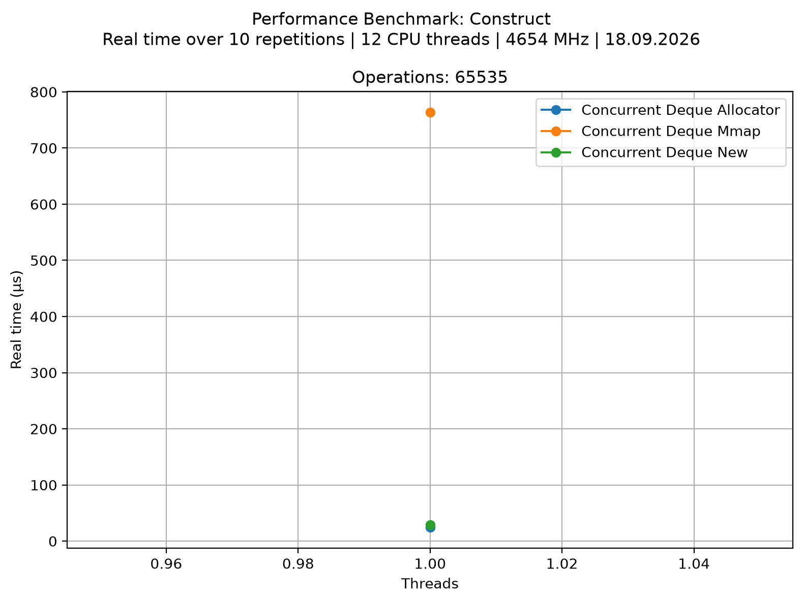
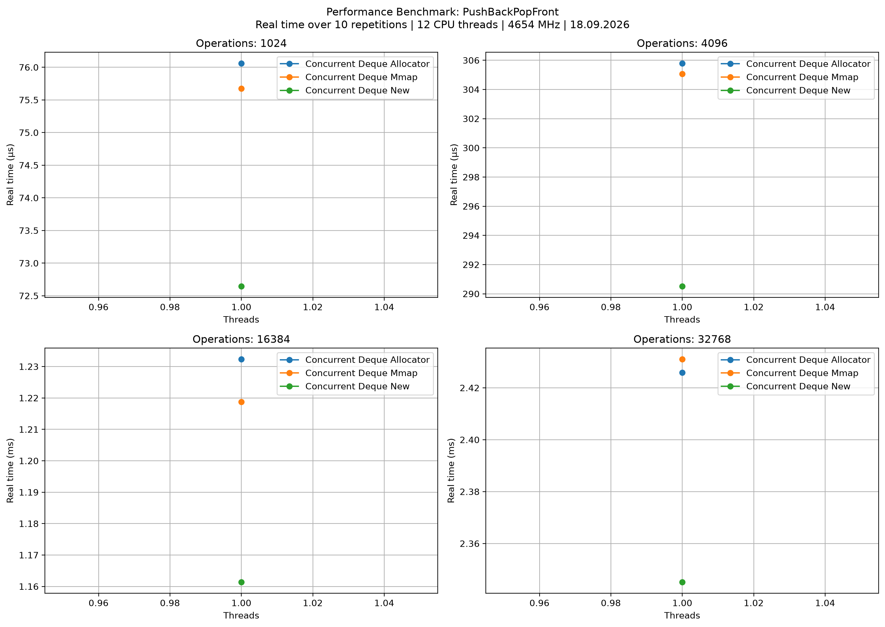
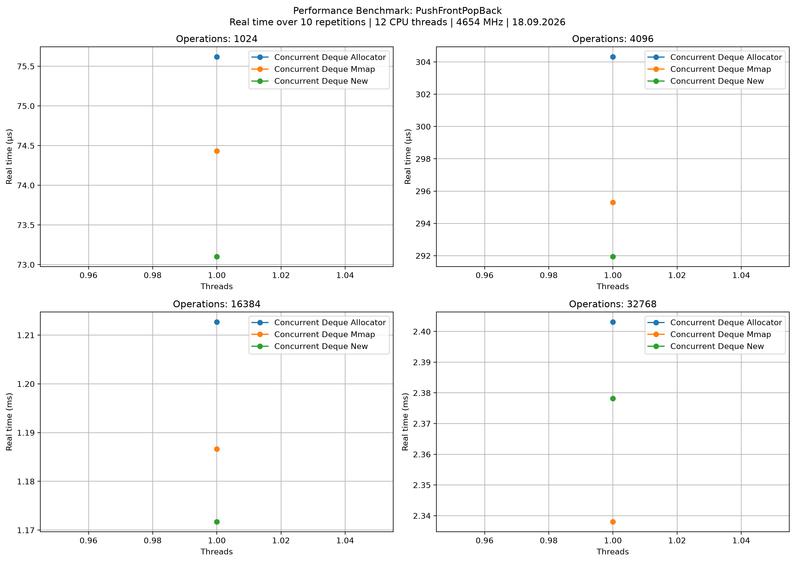
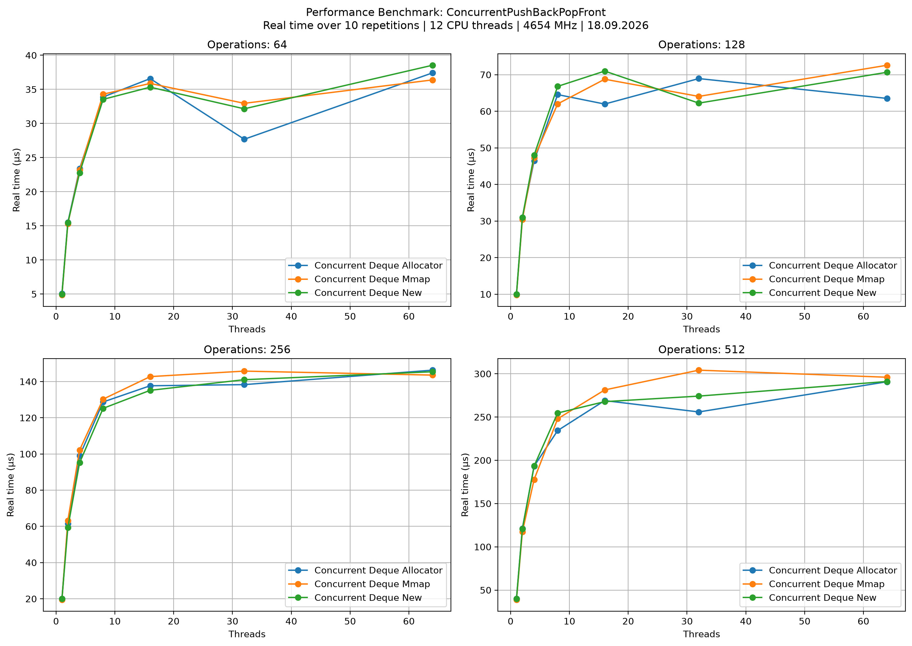

# `ventra::concurrent_deque<T, MaxThreads, SlotsPerThread, Capacity, Arena>`

Experimenteller konkurrierender Deque-Typ mit fester Knotenkapazitaet zur Compile-Zeit. Die Klasse ist fuer lock-free Push/Pop-Pfade mit Hazard-Pointer-geschuetzter Node-Wiederverwendung ausgelegt.

## Header

```cpp
#include <ventra/deque/concurrent_deque.hpp>
```

## Kurzueberblick

- Jeder Aufruf bekommt eine explizite `thread_id` im Bereich `[0, MaxThreads)`.
- `push_back`, `push_front`, `pop_back`, `pop_front`, `emplace_back` und `emplace_front` liefern `bool`.
- `Capacity` ist die feste Knotenzahl der Arena; Index `0` ist reserviert, nutzbar sind daher hoechstens `Capacity - 1` Elemente.
- `SlotsPerThread` muss mindestens `2` sein, weil Pop/Stabilize-Pfade zwei Hazard-Slots brauchen.
- Der Arena-Typ ist als Template-Template-Parameter waehlbar: `memory_arena_new`, `memory_arena_allocator`, `memory_arena_mmap` oder eine kompatible eigene Arena.
- Der Anchor nutzt 16-Byte-CAS und setzt `x86_64` mit `CMPXCHG16B` voraus.

## Template-Parameter

| Parameter | Default | Beschreibung |
| --- | --- | --- |
| `T` | - | Elementtyp. |
| `MaxThreads` | - | Maximale Anzahl aktiver Thread-IDs. |
| `SlotsPerThread` | `2` | Hazard-Pointer-Slots pro Thread. |
| `Capacity` | `65536` | Arena-Knotenzahl; muss eine Zweierpotenz sein und darf `65536` nicht ueberschreiten. |
| `Arena` | `memory_arena_new` | Arena-Template fuer Node-Speicher und Reclamation. |

## Konstruktion

| API | Beschreibung |
| --- | --- |
| `concurrent_deque()` | Erzeugt ein leeres Deque mit default-konstruiertem Arena-Member. |
| `concurrent_deque(std::in_place_t, ArenaArgs&&...)` | Erzeugt ein leeres Deque und forwardet die Argumente an die gewaehlte Arena. |
| `~concurrent_deque()` | Raeumt die Arena auf. Worker-Threads muessen vorher gestoppt sein. |

## Operationen

| API | Beschreibung |
| --- | --- |
| `bool push_back(std::size_t thread_id, T&& value)` | Fuegt hinten per Move ein. |
| `bool push_back(std::size_t thread_id, const T& value)` | Fuegt hinten per Copy ein. |
| `bool emplace_back(std::size_t thread_id, Args&&... args)` | Konstruiert hinten direkt im Node. |
| `bool push_front(std::size_t thread_id, T&& value)` | Fuegt vorne per Move ein. |
| `bool push_front(std::size_t thread_id, const T& value)` | Fuegt vorne per Copy ein. |
| `bool emplace_front(std::size_t thread_id, Args&&... args)` | Konstruiert vorne direkt im Node. |
| `bool pop_back(std::size_t thread_id, T& out)` | Entfernt hinten und schreibt nach `out`. |
| `bool pop_front(std::size_t thread_id, T& out)` | Entfernt vorne und schreibt nach `out`. |

`false` bedeutet bei Push/Emplace, dass aktuell kein Node verfuegbar ist. Bei Pop bedeutet `false`, dass das Deque leer ist.

## Arena-Auswahl

```cpp
ventra::concurrent_deque<int, 8> default_arena;

ventra::concurrent_deque<
    int,
    8,
    2,
    65536,
    memory_arena_allocator
> allocator_arena;

ventra::concurrent_deque<
    int,
    8,
    2,
    65536,
    memory_arena_mmap
> mmap_arena;
```

Eine eigene Arena muss die gleiche Template-Form und die von `concurrent_deque` genutzten Member bereitstellen: `null_idx`, `allocate_idx`, `get`, `protect`, `clear_hazard`, `clear_all_hazards`, `release_unpublished_idx` und `retire_node`.

## Hinweise

- Die Klasse besitzt derzeit keine oeffentliche `size()`, `empty()` oder Iterator-API.
- `thread_id` wird nur per `assert` geprueft.
- Retired Nodes werden erst wiederverwendet, wenn die Arena-Reclamation sie als nicht mehr durch Hazard-Pointer geschuetzt erkennt.
- Wenn Freelist und unbenutzte Nodes erschoepft sind, pruefen die Standard-Arenen auch die Retired-Listen anderer Thread-IDs. Jede Liste wird atomar zum Scannen uebernommen; dadurch bleiben freie Nodes auch dann wiederverwendbar, wenn der urspruengliche Thread keine weiteren Operationen ausfuehrt.
- Benchmarks sollten im Release-Build laufen; Debug-Builds verzerren die Synchronisationskosten deutlich.

## Beispiel

```cpp
#include <iostream>

#include <ventra/deque/concurrent_deque.hpp>

int main() {
    ventra::concurrent_deque<int, 1> values;

    if (!values.push_back(0, 10)) {
        return 1;
    }

    int out = 0;
    if (values.pop_front(0, out)) {
        std::cout << out << '\n';
    }
}
```

## Benchmarks

<!-- AUTO-BENCHMARKS:BEGIN -->


### Construct




### Push Back Pop Front




### Push Front Pop Back




### Concurrent Push Back Pop Front



<!-- AUTO-BENCHMARKS:END -->
