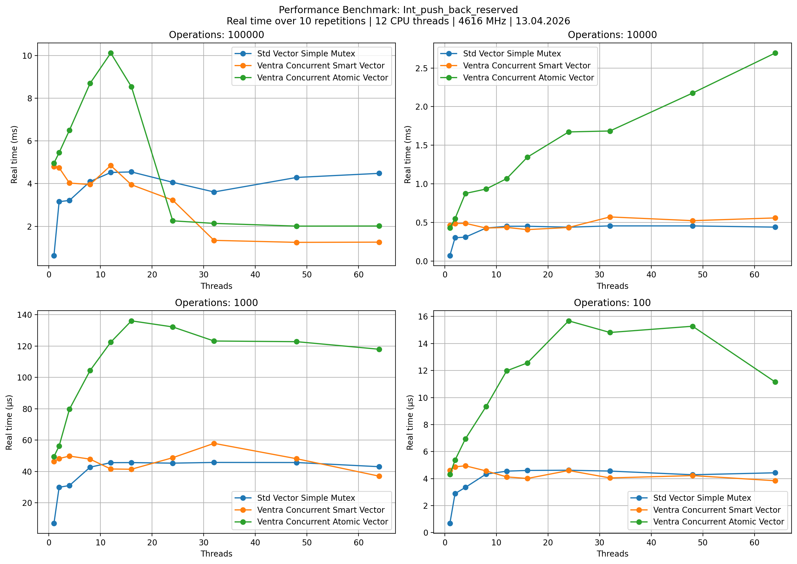
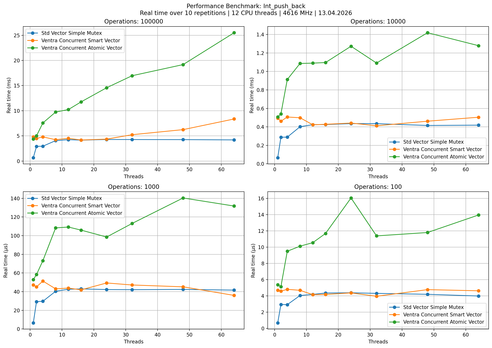

# `ventra::concurrent_atomic_vector<T>`

Short description.

## Header

```cpp
#include <ventra/concurrent_atomic_vector.hpp>
```

## Overview

- TODO describe purpose
- TODO describe important properties

## Example

```cpp
ventra::concurrent_atomic_vector<int> object;
```

## Benchmarks

<!-- AUTO-BENCHMARKS:BEGIN -->

### Int Push Back


### Int Push Back Reserved


### String Push Back


### String Push Back Reserved


### Int_push_back_reserved




### Int_push_back



<!-- AUTO-BENCHMARKS:END -->
