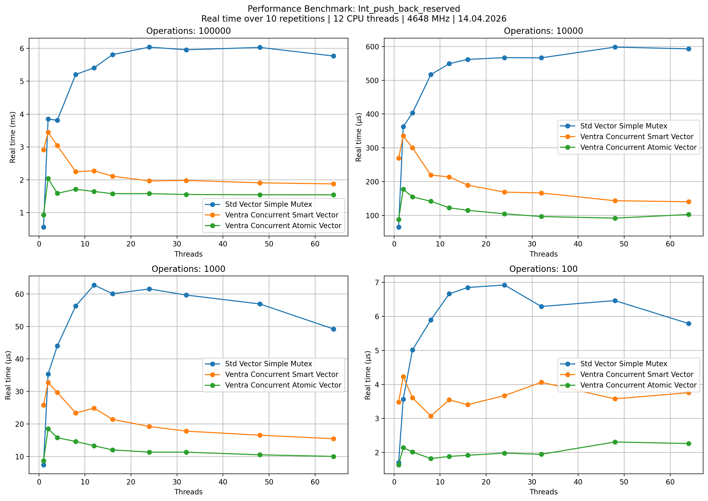
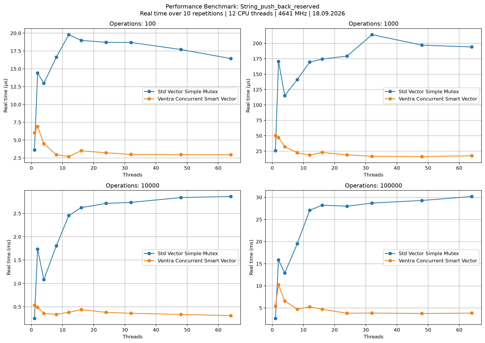
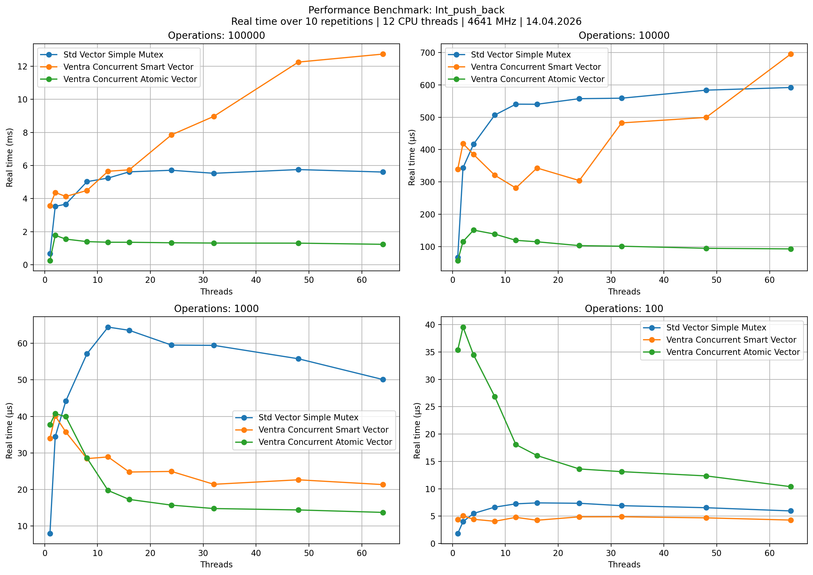
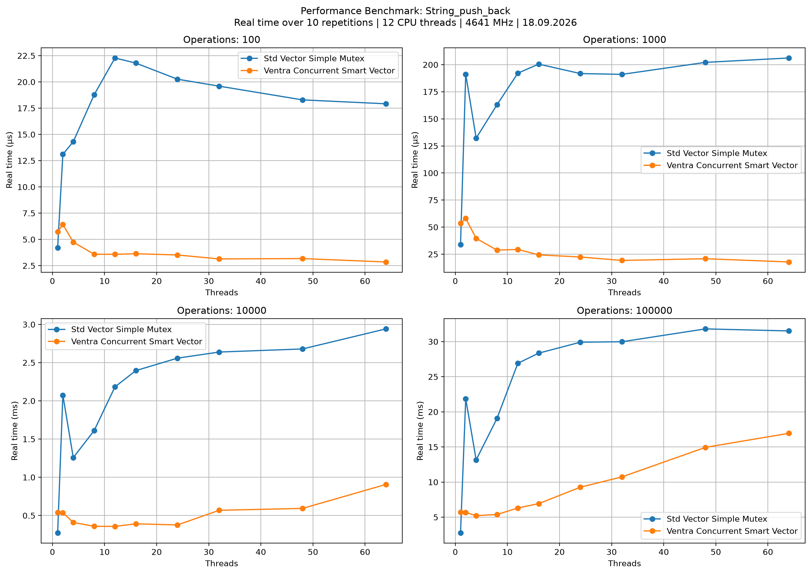
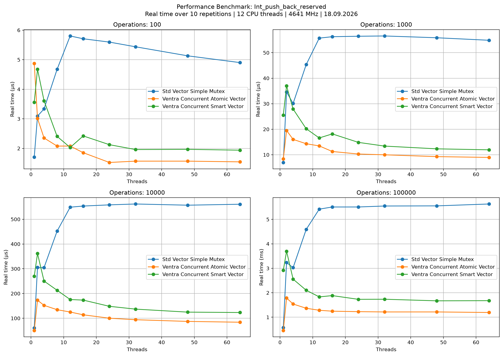
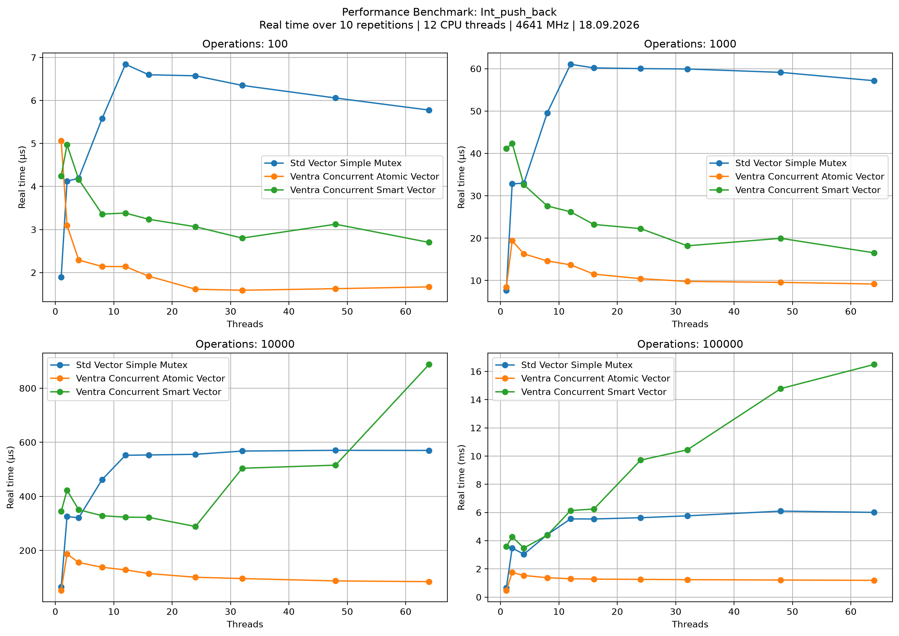

# `ventra::concurrent_smart_vector<T>`

Konkurrierender, append-orientierter Container fuer komplexere Typen. Die Klasse speichert jedes Element als atomisch ausgetauschtes `std::shared_ptr<T>` und eignet sich damit besser fuer nicht-triviale Objekte als `concurrent_atomic_vector`.

## Header

```cpp
#include <ventra/vector/concurrent_smart_vector.hpp>
```

## Kurzueberblick

- Paralleles `push_back()` fuer viele Threads
- Lesezugriff ueber `std::optional<std::shared_ptr<T>>`
- Vorhandene Elemente lassen sich per `set()` atomisch ersetzen
- Kapazitaet waechst chunk-basiert in Potenzen von zwei
- Kein `erase()`, kein `clear()`, keine Iterator-API

## API

### Konstruktion

| API | Beschreibung |
| --- | --- |
| `concurrent_smart_vector()` | Leerer Container mit initialer Kapazitaet von `32`. |
| `concurrent_smart_vector(size_t initial_capacity)` | Reserviert ausreichend Chunks fuer mindestens diese Groessenordnung. |
| `concurrent_smart_vector(size_t count, value)` | Vorhandener Fuell-Konstruktor, im aktuellen Stand aber eher experimentell. |
| Copy-Konstruktion / Copy-Assignment | Geloescht. |

### Zugriff

| API | Beschreibung |
| --- | --- |
| `at(size_t idx)` | Liefert `std::optional<std::shared_ptr<T>>`. |
| `front()` / `back()` | Erstes bzw. letztes Element als `std::optional<std::shared_ptr<T>>`. |

### Kapazitaet

| API | Beschreibung |
| --- | --- |
| `size()` | Anzahl logisch angehaengter Elemente. |
| `capacity()` | Anzahl aktuell allokierter Slots ueber alle Chunks. |
| `empty()` | `true`, wenn `size() == 0`. |
| `reserve(size_t new_capacity)` | Allokiert genug Chunks fuer mindestens diese Groessenordnung. |

### Aenderungen

| API | Beschreibung |
| --- | --- |
| `push_back(const T&)` / `push_back(T&&)` | Fuegt hinten ein. |
| `set(size_t idx, const T& value)` / `set(size_t idx, T&& value)` | Ersetzt ein vorhandenes Element. |
| `set(size_t idx, Args&&... args)` | Konstruiert ein Ersatzobjekt direkt fuer einen vorhandenen Index. |
| `fast_unpack_return_val(optional<shared_ptr<T>>, T& out)` | Hilfsfunktion, um den Rueckgabewert schnell in `out` zu kopieren. |

## Hinweise

- `at()` kann `std::nullopt` liefern, wenn der Index ausserhalb von `size()` liegt oder ein Slot noch nicht publiziert ist.
- `set()` sollte nur fuer vorhandene Indizes `< size()` verwendet werden.
- `front()` und `back()` sollten nur auf nicht-leeren Containern verwendet werden.
- `reserve()` waechst chunk-basiert. Die resultierende `capacity()` kann daher groesser als der angeforderte Wert sein.
- Durch `std::shared_ptr<T>` ist der Container flexibler fuer komplexe Typen, aber pro Element schwerer als `concurrent_atomic_vector`.

## Beispiel

```cpp
#include <iostream>
#include <string>

#include <ventra/vector/concurrent_smart_vector.hpp>

int main() {
    ventra::concurrent_smart_vector<std::string> values;

    values.push_back("Ada");
    values.push_back("Linus");
    values.set(1, "Grace");

    if (auto item = values.at(1)) {
        std::cout << *item.value() << '\n';
    }
}
```

## Benchmarks

<!-- AUTO-BENCHMARKS:BEGIN -->

### Int_push_back_reserved




### String_push_back_reserved




### Int_push_back




### String_push_back




### Int_push_back_reserved




### Int_push_back



<!-- AUTO-BENCHMARKS:END -->
