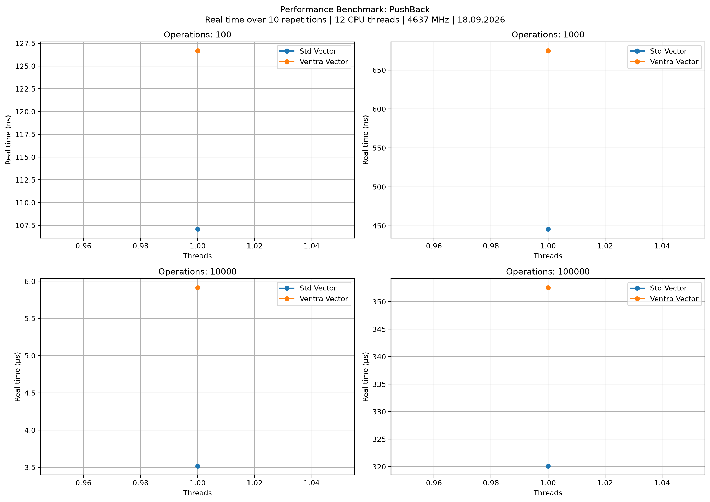
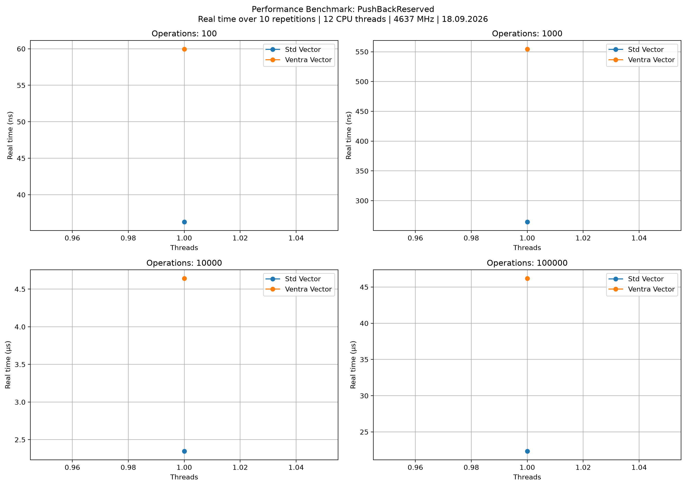

# `ventra::vector<T>`

Kleiner Header-only Vektor mit zusammenhaengendem Speicher. Die Klasse deckt die gaengigen Grundoperationen ab, bleibt aber bewusst schlanker als `std::vector`.

## Header

```cpp
#include <ventra/vector/vector.hpp>
```

## Kurzueberblick

- Zusammenhaengender Speicher fuer `T`
- Copy- und Move-Semantik
- Pointer-basierte Iteratoren
- Automatisches Wachstum bei `push_back()` und `emplace_back()`
- Manuelle Kapazitaetssteuerung ueber `reserve()` und `shrink_to_fit()`

## API

### Konstruktion

| API | Beschreibung |
| --- | --- |
| `vector()` | Leerer Vektor. |
| `vector(size_t size)` | Erzeugt `size` default-konstruierten Elemente. |
| `vector(size_t count, value)` | Erzeugt `count` Kopien des Werts. |
| `vector(std::initializer_list<T> init_list)` | Erzeugt den Vektor aus einer Liste. |
| `vector(const vector& other)` / `vector(vector&& other)` | Copy- bzw. Move-Konstruktion. |
| `operator=(...)` | Copy- und Move-Assignment sind verfuegbar. |

### Zugriff

| API | Beschreibung |
| --- | --- |
| `at(size_t idx)` | Gepruefter Zugriff, wirft `std::out_of_range`. |
| `operator[](size_t idx)` | Ungepruefter Zugriff. |
| `front()` / `back()` | Erstes bzw. letztes Element, ohne Bounds-Check. |
| `data()` | Pointer auf den zusammenhaengenden Speicher. |

### Kapazitaet

| API | Beschreibung |
| --- | --- |
| `empty()` | `true`, wenn `size() == 0`. |
| `size()` | Anzahl konstruierter Elemente. |
| `capacity()` | Aktuell reservierte Kapazitaet. |
| `reserve(size_t new_capacity)` | Erhoeht die Kapazitaet bei Bedarf. |
| `shrink_to_fit()` | Reduziert die Kapazitaet auf `size()`. |
| `resize(size_t new_size)` | Verkleinert oder erweitert mit default-konstruierten Werten. |

### Aenderungen

| API | Beschreibung |
| --- | --- |
| `emplace_back(Args&&... args)` | Konstruiert direkt am Ende und liefert eine Referenz auf das neue Element. |
| `push_back(value)` | Fuegt einen Wert am Ende an. |
| `pop_back()` | Entfernt das letzte Element, auf leerem Vektor ein No-Op. |
| `pop(size_t idx)` | Entfernt das Element an `idx`, bei ungueltigem Index ein No-Op. |
| `insert(T* pos, value)` | Fuegt vor `pos` ein. `pos` muss aus diesem Vektor stammen. |
| `erase(T* pos)` | Entfernt das Element an `pos` und liefert die naechste Position. |
| `clear()` | Entfernt alle Elemente und behaelt die allokierte Kapazitaet. |

### Iteratoren und Vergleich

| API | Beschreibung |
| --- | --- |
| `begin()` / `end()` | Iteratoren als rohe Pointer. |
| `operator==` | Vergleicht erst Groesse, dann alle Elemente. |

## Hinweise

- Ein leerer Vektor liefert fuer `data()`, `begin()` und `end()` `nullptr`.
- Reallokationen machen alle Pointer, Referenzen und Iteratoren ungueltig.
- `insert()`, `erase()` und `resize()` koennen Positionen ab der Aenderungsstelle verschieben.
- Die Klasse ist nicht thread-safe.

## Beispiel

```cpp
#include <iostream>
#include <string>

#include <ventra/vector/vector.hpp>

int main() {
    ventra::vector<std::string> names;

    names.emplace_back("Ada");
    names.push_back("Linus");
    names.insert(names.begin() + 1, "Grace");

    for (const auto& name : names) {
        std::cout << name << '\n';
    }
}
```

## Benchmarks

<!-- AUTO-BENCHMARKS:BEGIN -->


### Push Back




### Push Back Reserved



<!-- AUTO-BENCHMARKS:END -->
