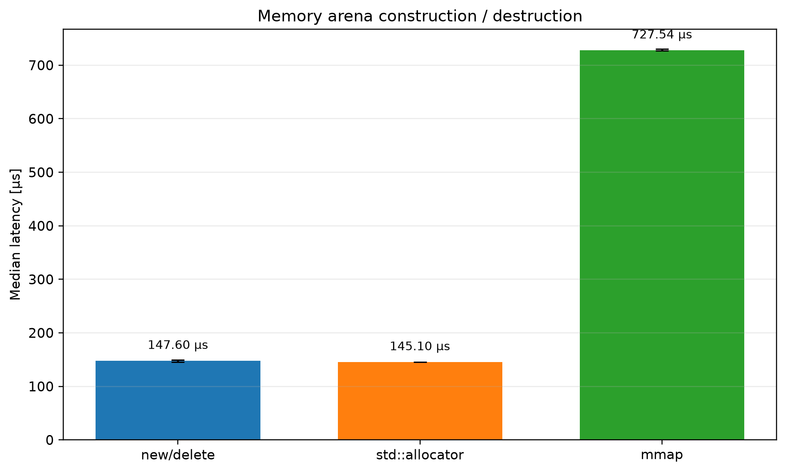
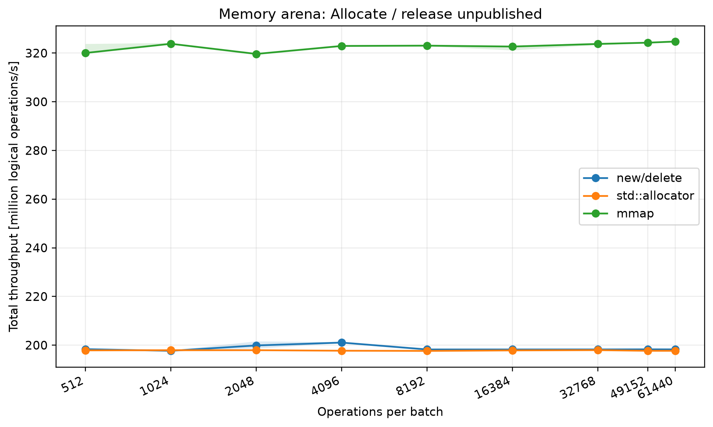
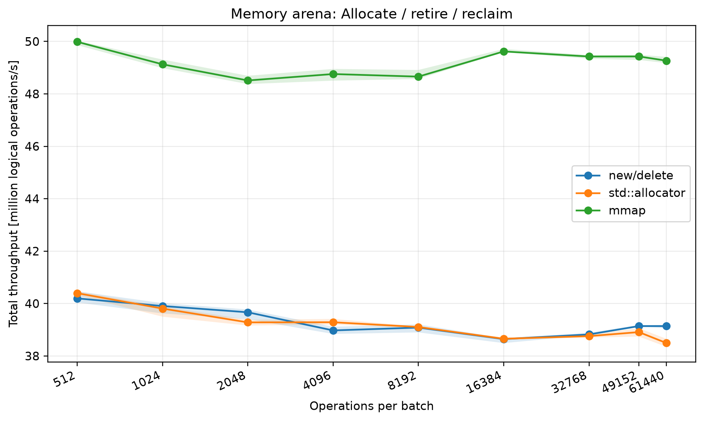
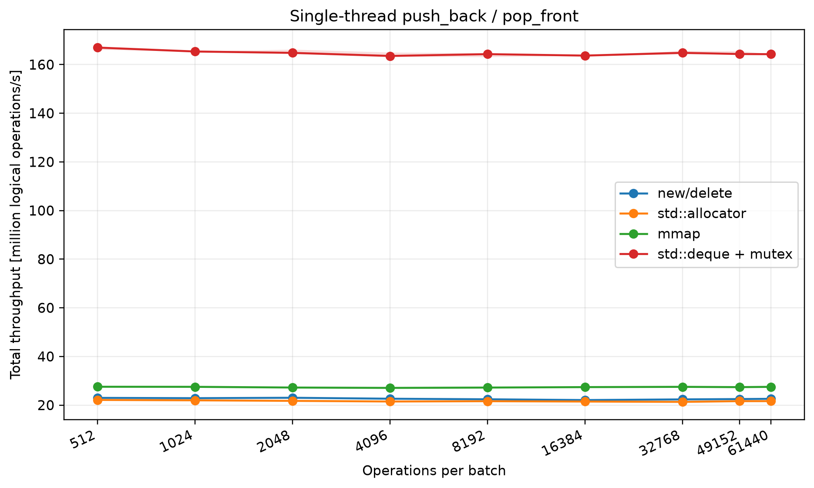
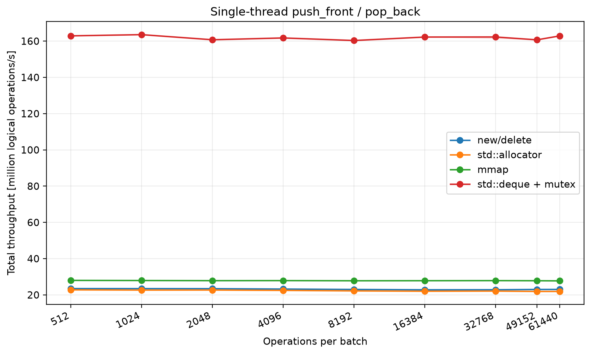
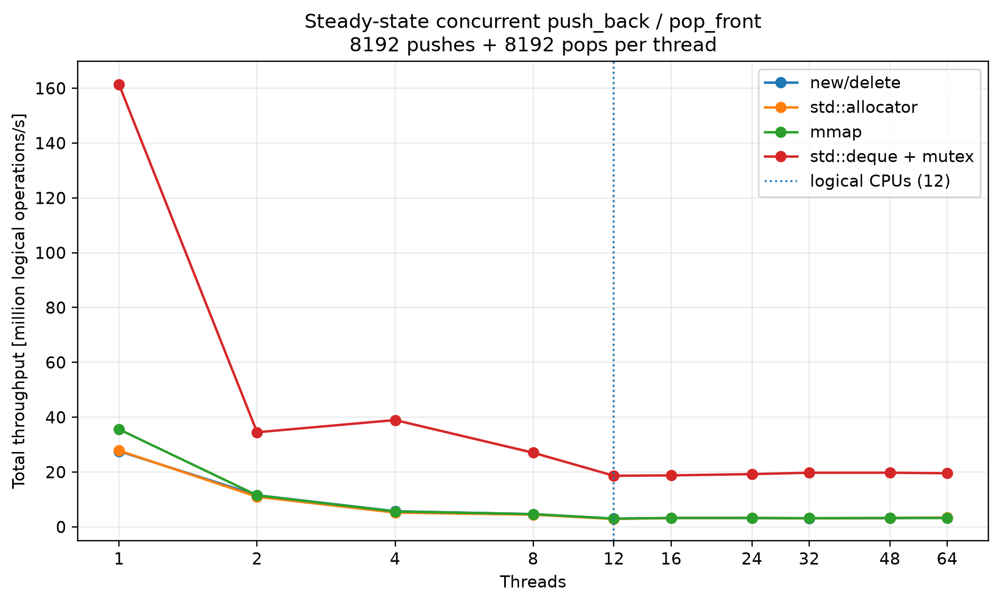
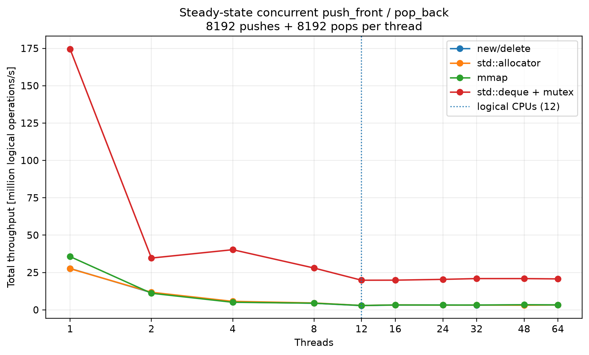
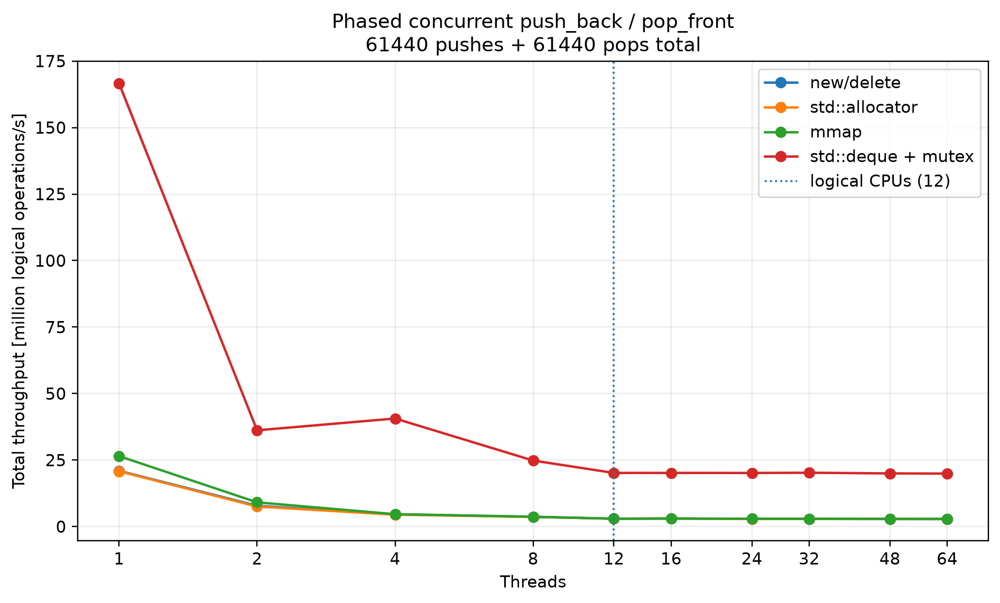
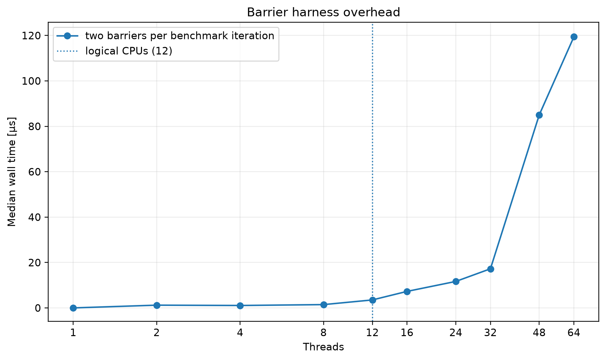

# Analyse der lock-free Concurrent Deque und Memory-Arenen

Stand: 2026-09-20  
Projekt: `libVentra`  
Fokus: `ventra::concurrent_deque`, 128-Bit-Anchor, Hazard Pointer, Arena-Varianten und Linux-orientierte Optimierung.

## Kurzfazit

Die Implementierung ist eine experimentelle, kapazitaetsbegrenzte, lock-free Deque mit expliziten Thread-IDs, Hazard-Pointer-basierter Speicherfreigabe und austauschbarer Arena-Strategie. Die zentrale technische Idee ist ein 16 Byte grosser Anchor, der `first_node_idx`, `last_node_idx`, einen Zwischenzustand und einen Versionszaehler per x86-64 `CMPXCHG16B` atomar aktualisiert. Push-Operationen koennen einen temporaeren Zustand (`frontPush` oder `backPush`) veroeffentlichen; konkurrierende Threads helfen danach ueber `stabilize_front` oder `stabilize_back`, die bidirektionalen Links zu vervollstaendigen.

Die Memory-Arenen zeigen den erwarteten Effekt: `memory_arena_mmap` ist bei wiederholten Allocate/Release-Pfaden deutlich schneller als `new/delete` und `std::allocator`, weil Knoten zusammenhaengend vorliegen und nicht pro Wiederverwendung neu alloziert werden. Dieser Vorteil bleibt in Single-Thread-Deque-Messungen sichtbar, verschwindet aber fast vollstaendig in hochkontendierten Mehrthread-Workloads. Dort dominiert nicht mehr der Allocator, sondern der gemeinsame Anchor als globaler Synchronisationspunkt.

Wichtig fuer die wissenschaftliche Einordnung: "lock-free" bedeutet hier Fortschritt ohne gegenseitiges Blockieren, nicht automatisch bessere Laufzeit. Die Benchmarks zeigen sogar, dass `std::deque + std::mutex` in den gemessenen Workloads deutlich schneller ist. Das liegt an sehr kurzen kritischen Abschnitten, hoher CAS-Retry-Rate der lock-free Struktur und der Tatsache, dass alle Threads dieselbe Deque und denselben Anchor belasten.

## Betrachtete Dateien

- `include/ventra/deque/concurrent_deque.hpp`
- `include/ventra/deque/concurrent_deque.tpp`
- `include/ventra/deque/concurrent_deque_anchor.hpp`
- `include/ventra/deque/concurrent_deque_hazard_pointer.hpp`
- `include/ventra/deque/concurrent_deque_memory_arena.hpp`
- `include/ventra/deque/concurrent_deque_memory_arena_new.hpp`
- `include/ventra/deque/concurrent_deque_memory_arena_std_aloc.hpp`
- `include/ventra/deque/concurrent_deque_memory_arena_mmap.hpp`
- `benchmarks/deque/concurrent_deque_benchmark.cpp`
- `test/deque/concurrent_deque_test.cpp`
- `plots/summary.csv`, `plots/relative_performance.csv`, `plots/coverage.csv`

## Datenstruktur und Algorithmus

### Anchor

Der `anchor` ist als `alignas(16)` definiert und speichert seine komplette logische Sicht in einem `unsigned __int128`. Gepackt werden:

| Feld | Breite | Bedeutung |
| --- | ---: | --- |
| `first_node_idx` | 32 Bit | Index des vorderen Knotens |
| `last_node_idx` | 32 Bit | Index des hinteren Knotens |
| `state` | 2 Bit | `stable`, `frontPush`, `backPush` |
| `version` | 62 Bit | ABA-Schutz fuer Anchor-Aenderungen |

Der Code setzt x86-64 und `CMPXCHG16B` voraus (`-mcx16`). Dadurch kann der Anchor als ein einziges atomares Wort betrachtet werden. Das reduziert die Komplexitaet gegenueber getrennten atomaren Head/Tail-Zeigern, koppelt aber beide Deque-Enden an denselben CAS-Hotspot.

### Knoten

Ein Knoten enthaelt:

- `previous_node_idx`
- `next_node_idx`
- `freelist_next`
- `version`
- uninitialisierten Speicher fuer `V`

Der Nutzwert `V` wird mit `std::construct_at` direkt im Knotenspeicher konstruiert und mit `std::destroy_at` beim Pop zerstoert. Dadurch kann die Arena Knoten separat vom Lebenszyklus des Nutzwerts verwalten.

Hinweis: `node::version` wird aktuell nur beim Push gesetzt, aber nicht zur Validierung gelesen. Fuer `V = int` waechst ein Knoten dadurch in einer gleich aufgebauten Spiegelstruktur von 16 auf 32 Byte. Bei `Capacity = 65536` entspricht das ca. 2 MiB statt ca. 1 MiB fuer reine Knoten ohne `version`. Als Optimierung ist entweder die Entfernung dieses Feldes oder seine echte Verwendung in getaggten Links sinnvoll.

### Push

Bei `push_back` und `push_front` wird zuerst ein Knoten aus der Arena angefordert. Danach wird `V` konstruiert. Falls die Konstruktion fehlschlaegt, wird der noch nicht veroeffentlichte Knoten sofort zurueckgegeben.

Bei leerer Deque wird der Anchor direkt von leer auf `{node, node, stable, version+1}` gesetzt.

Bei nicht leerer Deque laeuft Push zweiphasig:

1. Der neue Knoten wird vorbereitet.
2. Der Anchor wird per CAS auf `backPush` oder `frontPush` gesetzt.
3. `stabilize_back` oder `stabilize_front` vervollstaendigt den Gegenlink des alten Endknotens.
4. Der Anchor wird wieder auf `stable` gesetzt.

Die Helping-Logik ist wichtig fuer Lock-Freedom: Auch ein anderer Thread, der einen unstabilen Anchor sieht, kann die Stabilisierung uebernehmen.

In der aktuellen Fassung validieren `stabilize_front` und `stabilize_back` den Anchor in der inneren Stabilisierungsschleife vor jedem CAS auf den Gegenlink. Das ist eine Verbesserung gegenueber einem spaeteren Check nach einem fehlgeschlagenen Link-CAS: Wenn der temporaere `frontPush`- oder `backPush`-Zustand bereits durch einen anderen Thread abgeschlossen oder ersetzt wurde, bricht der Helfer frueher ab und schreibt nicht mehr auf Basis eines veralteten Anchor-Snapshots weiter. Die geschuetzten Knoten bleiben durch die Hazard-Pointer-Slots zwar weiterhin vor Reuse geschuetzt, aber die neue Reihenfolge reduziert unnoetige Link-CAS-Versuche und macht das Korrektheitsargument sauberer.

### Pop

`pop_back` und `pop_front` arbeiten nur bei stabilem Anchor. Ist der Anchor unstabil, wird zuerst geholfen. Vor dem Dereferenzieren werden ein oder zwei Hazard-Pointer-Slots gesetzt:

- Slot 0 schuetzt den aktuellen Endknoten.
- Slot 1 schuetzt den neuen Endknoten, falls mehr als ein Element vorhanden ist.

Danach wird der Anchor erneut validiert. Die eigentliche Entfernung linearisiert an dem CAS, der den Anchor auf den neuen Endknoten oder auf leer setzt. Erst danach wird der Wert nach `out` bewegt, zerstoert und der entfernte Knoten retired.

## Speicherverwaltung

Alle Arena-Varianten nutzen Index `0` als `null_idx`. Bei `Capacity = 65536` sind daher maximal 65535 Elemente gleichzeitig nutzbar.

### Gemeinsamer Arena-Unterbau

`memory_arena` verwaltet pro Thread eine Retired-Liste. Ein Knoten wird nach dem Pop nicht sofort wieder freigegeben, sondern erst retired. Beim Reclaim wird die Retired-Liste atomar abgetrennt und gegen alle Hazard-Pointer-Slots geprueft. Ist kein Hazard-Pointer auf den Knoten gesetzt, wird der Index wieder freigegeben.

Der Reclaim-Trigger ist:

```text
MaxThreads * HazardSlotsPerThread * 2 + 16
```

Bei den Benchmark-Parametern `MaxThreads = 64` und `SlotsPerThread = 2` ergibt das einen Schwellenwert von 272 retired Knoten.

### `memory_arena_new`

Diese Variante verwaltet eine Slot-Tabelle. Jeder Slot enthaelt einen atomaren `N*` und einen Freelist-Index. Beim Wiederverwenden eines Index wird ein neuer Knoten mit `new N()` erzeugt; beim Freigeben wird der Knoten mit `delete` zerstoert.

Vorteile:

- einfache Baseline gegen klassischen Heap
- echte Allokationskosten werden sichtbar
- Slots bleiben stabil indexierbar

Nachteile:

- zusaetzliche Pointer-Indirektion pro Zugriff
- pro Wiederverwendung erneute Heap-Allokation
- globale Freelist bleibt ein Contention-Punkt

### `memory_arena_allocator`

Diese Variante ist nahezu identisch zu `memory_arena_new`, nutzt aber `std::allocator_traits<std::allocator<N>>`. In den Messdaten ist sie praktisch gleich schnell oder leicht langsamer als `new/delete`. Das ist plausibel, weil der Standard-Allocator auf vielen Plattformen am Ende denselben allgemeinen Heap-Pfad nutzt und hier keine Pooling-Strategie hinzukommt.

### `memory_arena_mmap`

Diese Variante reserviert einen zusammenhaengenden Speicherbereich mit:

```cpp
mmap(nullptr, bytes, PROT_READ | PROT_WRITE,
     MAP_PRIVATE | MAP_ANONYMOUS | MAP_NORESERVE, -1, 0)
```

Danach werden alle `N`-Knoten mit `std::construct_at` vorinitialisiert. Allocate/Release bewegt spaeter nur noch Indizes durch die Freelist; der Knoten selbst wird nicht pro Operation erzeugt oder zerstoert.

Vorteile:

- zusammenhaengende Speicherlage
- keine Heap-Allokation im Hot Path
- weniger Pointer-Indirektion als bei Slot-basierten Varianten
- sehr schnelle Allocate/Release-Pfade

Nachteile:

- hohe Konstruktionskosten, weil alle Knoten initialisiert werden
- fixe Kapazitaet
- Linux-/POSIX-spezifisch
- `MAP_NORESERVE` spart Commit-Reserve, die anschliessende Initialisierung beruehrt aber trotzdem Seiten

## Synchronisation und Memory Ordering

Der Code nutzt im Hot Path vor allem `acquire`, `release` und `acq_rel`. Der Anchor wird per acquire geladen und per acq_rel-CAS aktualisiert. Linkfelder werden ebenfalls mit acquire gelesen und mit acq_rel-CAS korrigiert.

Die Hazard-Pointer-Publikation nutzt aktuell `memory_order_seq_cst`. Das ist konservativ und fuer Hazard-Pointer-Algorithmen verstaendlich, weil die Publikation vor dem erneuten Validieren sichtbar sein muss. Auf x86-64 kann eine seq_cst-Store-Operation aber deutlich teurer sein als eine Release-Store-Operation, weil sie typischerweise staerkere globale Ordnung erzwingt. Eine Optimierung in diesem Bereich sollte nur mit Korrektheitsargument und Stress-Tests erfolgen, z.B. als kontrollierter Vergleich:

- aktueller `seq_cst`-Store
- `release`-Store plus geeignete Fence-/Revalidierungsstrategie
- Epoch-based reclamation statt Hazard Pointer
- QSBR/RCU-artige Variante fuer Workloads mit kontrollierten Thread-Quiescence-Punkten

## Benchmark-Setup

Die ausgewerteten Daten stammen aus `plots/summary.csv` und `plots/relative_performance.csv`.

Kontext laut `plots/benchmark_context.csv`:

| Merkmal | Wert |
| --- | --- |
| Datum | 2026-09-19T13:34:46+02:00 |
| Host | `nixos` |
| CPUs | 12 |
| MHz pro CPU | 4628 |
| CPU-Scaling | deaktiviert |
| L1d/L1i | 32 KiB / 32 KiB |
| L2 | 512 KiB |
| L3 | 32 MiB |
| Build | release |
| Wiederholungen | 30 |

`plots/coverage.csv` enthaelt 503 vollstaendige Messzeilen ohne fehlgeschlagene oder unvollstaendige Wiederholungen.

Hinweis: Die folgenden Messwerte stammen aus den vorhandenen Plot-/CSV-Dateien. Wenn die Stabilisierungsaenderung neu benchmarked wurde, sollten die Tabellen aus den neuen CSVs erneut generiert werden; die qualitative Analyse zum Algorithmus ist bereits auf die aktuelle `.tpp` angepasst.

## Messergebnisse

### Konstruktion der Arenen

| Implementierung | Median ns | CV |
| --- | ---: | ---: |
| `mmap` | 727541.4 | 0.59 % |
| `new/delete` | 147600.7 | 2.25 % |
| `std::allocator` | 145103.5 | 0.12 % |

Interpretation: `mmap` ist beim Erzeugen deutlich teurer, weil der gesamte Knotenbereich vorinitialisiert wird. Das ist ein klassischer Trade-off: teure Initialisierung gegen schnelle Hot-Path-Operationen.



### Arena-Hot-Path bei 61440 Operationen

| Workload | Implementierung | Mops/s | ns/op | relativ zu `new/delete` |
| --- | --- | ---: | ---: | ---: |
| `AllocateReleaseUnpublished` | `mmap` | 324.74 | 3.08 | 1.64x |
| `AllocateReleaseUnpublished` | `new/delete` | 198.25 | 5.04 | 1.00x |
| `AllocateReleaseUnpublished` | `std::allocator` | 197.67 | 5.06 | 1.00x |
| `AllocateRetireReclaim` | `mmap` | 49.27 | 20.30 | 1.26x |
| `AllocateRetireReclaim` | `new/delete` | 39.14 | 25.55 | 1.00x |
| `AllocateRetireReclaim` | `std::allocator` | 38.49 | 25.98 | 0.98x |

Interpretation: Ohne Reclamation ist `mmap` ca. 64 % schneller als `new/delete`. Mit Retire/Reclaim schrumpft der Vorteil auf ca. 26 %, weil Hazard-Scanning, Retired-Listen und Freelist-CAS dominanter werden.





### Single-Thread-Deque bei 61440 Operationen

| Workload | Implementierung | Mops/s | ns/op | relativ zu `new/delete` | relativ zu Mutex |
| --- | --- | ---: | ---: | ---: | ---: |
| `PushBackPopFront` | `mmap` | 27.50 | 36.36 | 1.22x | 0.17x |
| `PushBackPopFront` | `new/delete` | 22.58 | 44.29 | 1.00x | 0.14x |
| `PushBackPopFront` | `std::allocator` | 21.62 | 46.25 | 0.96x | 0.13x |
| `PushBackPopFront` | `std::deque + mutex` | 164.26 | 6.09 | 7.28x | 1.00x |
| `PushFrontPopBack` | `mmap` | 27.74 | 36.05 | 1.20x | 0.17x |
| `PushFrontPopBack` | `new/delete` | 23.03 | 43.42 | 1.00x | 0.14x |
| `PushFrontPopBack` | `std::allocator` | 21.90 | 45.66 | 0.95x | 0.13x |
| `PushFrontPopBack` | `std::deque + mutex` | 162.87 | 6.14 | 7.07x | 1.00x |

Interpretation: `mmap` verbessert die lock-free Deque im Single-Thread-Fall um ca. 20 %. Trotzdem ist die Mutex-Baseline hier viel schneller, weil sie im Single-Thread-Fall praktisch keinen realen Synchronisationskonflikt hat und keine Hazard-Pointer, 128-Bit-CAS, Helping-Zustaende oder Retire-Listen braucht.





### Mehrthread-Verhalten

Auszug fuer 1, 12 und 64 Threads:

| Workload | Threads | Implementierung | Mops/s | Mops/s pro Thread |
| --- | ---: | --- | ---: | ---: |
| `PhasedPushBackPopFront` | 1 | `mmap` | 26.50 | 26.498 |
| `PhasedPushBackPopFront` | 1 | `new/delete` | 20.96 | 20.961 |
| `PhasedPushBackPopFront` | 1 | `std::allocator` | 20.79 | 20.794 |
| `PhasedPushBackPopFront` | 1 | `std::deque + mutex` | 166.62 | 166.625 |
| `PhasedPushBackPopFront` | 12 | `mmap` | 2.96 | 0.246 |
| `PhasedPushBackPopFront` | 12 | `new/delete` | 2.97 | 0.247 |
| `PhasedPushBackPopFront` | 12 | `std::allocator` | 2.97 | 0.247 |
| `PhasedPushBackPopFront` | 12 | `std::deque + mutex` | 20.18 | 1.682 |
| `PhasedPushBackPopFront` | 64 | `mmap` | 2.91 | 0.046 |
| `PhasedPushBackPopFront` | 64 | `new/delete` | 2.82 | 0.044 |
| `PhasedPushBackPopFront` | 64 | `std::allocator` | 2.86 | 0.045 |
| `PhasedPushBackPopFront` | 64 | `std::deque + mutex` | 19.93 | 0.311 |
| `SteadyPushBackPopFront` | 1 | `mmap` | 35.58 | 35.583 |
| `SteadyPushBackPopFront` | 1 | `new/delete` | 27.61 | 27.605 |
| `SteadyPushBackPopFront` | 1 | `std::allocator` | 27.84 | 27.836 |
| `SteadyPushBackPopFront` | 1 | `std::deque + mutex` | 161.30 | 161.304 |
| `SteadyPushBackPopFront` | 12 | `mmap` | 3.01 | 0.251 |
| `SteadyPushBackPopFront` | 12 | `new/delete` | 3.01 | 0.251 |
| `SteadyPushBackPopFront` | 12 | `std::allocator` | 2.88 | 0.240 |
| `SteadyPushBackPopFront` | 12 | `std::deque + mutex` | 18.65 | 1.554 |
| `SteadyPushBackPopFront` | 64 | `mmap` | 3.22 | 0.050 |
| `SteadyPushBackPopFront` | 64 | `new/delete` | 3.34 | 0.052 |
| `SteadyPushBackPopFront` | 64 | `std::allocator` | 3.38 | 0.053 |
| `SteadyPushBackPopFront` | 64 | `std::deque + mutex` | 19.56 | 0.306 |
| `SteadyPushFrontPopBack` | 1 | `mmap` | 35.62 | 35.623 |
| `SteadyPushFrontPopBack` | 1 | `new/delete` | 27.69 | 27.686 |
| `SteadyPushFrontPopBack` | 1 | `std::allocator` | 27.54 | 27.538 |
| `SteadyPushFrontPopBack` | 1 | `std::deque + mutex` | 174.40 | 174.397 |
| `SteadyPushFrontPopBack` | 12 | `mmap` | 2.92 | 0.244 |
| `SteadyPushFrontPopBack` | 12 | `new/delete` | 2.82 | 0.235 |
| `SteadyPushFrontPopBack` | 12 | `std::allocator` | 2.92 | 0.243 |
| `SteadyPushFrontPopBack` | 12 | `std::deque + mutex` | 19.82 | 1.651 |
| `SteadyPushFrontPopBack` | 64 | `mmap` | 3.32 | 0.052 |
| `SteadyPushFrontPopBack` | 64 | `new/delete` | 3.25 | 0.051 |
| `SteadyPushFrontPopBack` | 64 | `std::allocator` | 3.27 | 0.051 |
| `SteadyPushFrontPopBack` | 64 | `std::deque + mutex` | 20.70 | 0.324 |

Interpretation:

- Die lock-free Varianten skalieren in diesen Workloads nicht positiv.
- Ab ca. 12 Threads liegt die lock-free Deque nur noch bei ungefaehr 3 Mops/s.
- Die drei Arena-Varianten liegen im Mehrthread-Fall sehr nah beieinander. Das zeigt, dass der Allocator nicht mehr der limitierende Faktor ist.
- Die Mutex-Baseline verliert ebenfalls stark gegenueber 1 Thread, bleibt aber in diesen Messungen deutlich schneller.
- Der Phased-Benchmark enthaelt zwei Barrieren pro Iteration; der Steady-Benchmark reduziert diesen Effekt, zeigt aber trotzdem denselben Contention-Trend.







### Barrier-Effekt

Der separate Barrier-Benchmark zeigt, dass das Harness bei hoher Threadzahl sichtbar teuer wird:

| Threads | Median fuer zwei Barrieren |
| ---: | ---: |
| 1 | 14.3 ns |
| 2 | 1225.4 ns |
| 4 | 1084.1 ns |
| 8 | 1469.4 ns |
| 12 | 3526.0 ns |
| 16 | 7286.3 ns |
| 24 | 11678.7 ns |
| 32 | 17245.3 ns |
| 48 | 85046.6 ns |
| 64 | 119405.2 ns |

Dieser Effekt erklaert einen Teil der Phased-Ergebnisse, aber nicht den gesamten Durchsatzabfall, weil die Steady-State-Tests ohne Barriere im inneren Loop ebenfalls auf ca. 3 Mops/s fallen.



## Warum `mmap` im Hot Path gewinnt

`mmap` gewinnt nicht nur, weil `mmap` als Systemaufruf schnell waere. Im Gegenteil: der Systemaufruf und die Vorinitialisierung machen Konstruktion teuer. Der Vorteil entsteht danach:

1. Knoten liegen in einem zusammenhaengenden Array.
2. `get(idx)` ist nur `&nodes_[idx]`.
3. Es gibt keine atomare Slot-Pointer-Ladung pro Zugriff.
4. Release legt nur den Index in die Freelist zurueck.
5. Der allgemeine Heap wird aus dem Hot Path entfernt.

Damit misst der Vergleich nicht nur "Allocator A gegen Allocator B", sondern unterschiedliche Speicher- und Lebenszykluspolitiken:

- `new/delete` und `std::allocator`: Knotenobjekte werden bei Reuse neu erzeugt und zerstoert.
- `mmap`: Knotenobjekte bleiben bestehen; nur der enthaltene Nutzwert `V` lebt pro Push/Pop.

Diese Unterscheidung sollte in der wissenschaftlichen Arbeit explizit genannt werden, weil sie die Interpretation der Ergebnisse veraendert.

## Zentrale Performance-Grenzen

### 1. Globaler Anchor als Serialisierungspunkt

Jede Push- und Pop-Operation muss den 128-Bit-Anchor laden und meistens per CAS veraendern. Dadurch konkurrieren alle Threads auf derselben Cacheline. Unter hoher Contention entstehen:

- Cacheline-Ping-Pong zwischen Kernen
- CAS-Fehlschlaege
- erneutes Laden und Validieren des Anchors
- Helping-Arbeit fuer unstabile Zwischenzustaende

Das erklaert, warum die Arena-Optimierung im Mehrthread-Fall fast unsichtbar wird.

### 2. Hazard-Pointer-Kosten pro Pop

Jeder Pop setzt mindestens einen Hazard Pointer, bei mehr als einem Element zwei. Danach folgt eine Revalidierung. Diese Schritte sind korrektheitsrelevant, aber teuer:

- atomare Stores in 64-Byte-ausgerichtete Hazard-Slots
- erneute Anchor-Loads
- Hazard-Scan beim Reclaim ueber `MaxThreads * SlotsPerThread` Slots

Bei `MaxThreads = 64` und `SlotsPerThread = 2` werden beim Reclaim bis zu 128 Slots geprueft.

### 3. Gemeinsame Freelist

Alle Arenen verwenden eine globale Freelist mit versionsgetaggtem 64-Bit-Head. Das ist besser als ein ungeschuetzter Stack, bleibt aber ein weiterer gemeinsamer CAS-Punkt.

### 4. Sehr feingranulare Operationen

Die Benchmarks nutzen `int` als Nutzwert. Dadurch ist die eigentliche Arbeit extrem klein. Synchronisationskosten dominieren fast vollstaendig. Bei groesseren Elementen oder realer Arbeit zwischen Deque-Operationen wuerde sich das Verhaeltnis anders darstellen.

## Korrektheits- und Robustheitshinweise

Diese Punkte sind fuer eine wissenschaftliche Arbeit wichtig, weil sie die Gueltigkeit der Messung und die Grenzen der Implementierung beschreiben.

Aktuelle Verbesserung: Die Stabilisierungspfade pruefen den Anchor jetzt vor jedem Versuch, den fehlenden Gegenlink per CAS zu setzen. Dadurch wird die Helping-Arbeit enger an den beobachteten Anchor-Zustand gebunden. Fuer die Arbeit kann das als Reduktion stale arbeitender Helfer und als Verbesserung des Linearizability-Arguments beschrieben werden.

1. Destruktion einer nicht leeren Deque: Der Destruktor der Deque ist defaulted. Die Arena zerstoert Knotenobjekte, aber der manuell im Byte-Speicher konstruierte Wert `V` wird nur beim Pop zerstoert. Wenn die Deque nicht leer zerstoert wird, werden verbleibende `V`-Objekte nicht sauber destruiert. Eine robuste Bibliotheksversion sollte im Destruktor entweder leeren, eine `clear()`-Vorbedingung dokumentieren oder nur triviale Typen zulassen.

2. Exception Safety bei Pop: Nach erfolgreichem Anchor-CAS wird `out = std::move(*node->val_ptr())` ausgefuehrt. Wenn diese Move-Zuweisung wirft, ist der Knoten logisch bereits entfernt, aber Wertzerstoerung, Hazard-Clear und Retire koennen ausbleiben. Fuer produktive Nutzung sollte `pop` entweder `noexcept`-move-assignable Typen verlangen, in ein Rueckgabeobjekt konstruieren oder den Fehlerpfad absichern.

3. `thread_id` ist eine harte Vorbedingung: Die API erwartet eindeutige IDs in `[0, MaxThreads)`. In Release-Builds schuetzen nur `assert`s, also keine Laufzeitpruefung.

4. Fixed Capacity: Bei voller Arena liefern Push/Emplace `false`. Das ist fuer Benchmarks gut kontrollierbar, unterscheidet sich aber von dynamisch wachsenden Standardcontainern.

5. Anchor ist nicht portabel: `CMPXCHG16B`, `unsigned __int128` und GCC/Clang-Builtins sind x86-64/Linux-nahe. Das passt zur Linux-Optimierung, sollte aber als Plattformannahme beschrieben werden.

6. Namespace-Hinweis: `anchor` liegt aktuell im globalen Namespace. Fuer eine Bibliothek waere `ventra::detail::anchor` sauberer.

7. Versionszaehler: Anchor-Version mit 62 Bit ist praktisch ausreichend. Die Freelist nutzt einen 64-Bit-Wert mit 16-Bit-Index und 48-Bit-Version. Wraparound ist theoretisch moeglich, praktisch aber nur bei extrem langen Laufzeiten relevant.

## Bestehende Tests

Die Tests decken wichtige Eigenschaften ab:

- leere Pops
- FIFO/LIFO-Kombinationen
- `push_front`/`pop_back` und `push_back`/`pop_front`
- `emplace` mit `std::string`
- Wiederverwendung nach Kapazitaetsgrenze
- Reclamation retired Nodes in inaktiven Threads
- Hazard-respektierende Cross-Thread-Reclamation
- nahe Kapazitaet mit 24 Threads und 8 Runden
- chaotischer 64-Thread-Stresstest mit 50000 Operationen pro Thread

Das ist fuer ein experimentelles Projekt gut. Fuer eine wissenschaftliche Aussage waeren zusaetzlich hilfreich:

- ThreadSanitizer-Laeufe, soweit mit atomaren Lock-free-Strukturen sinnvoll interpretierbar
- gezielte Tests fuer Destruktion nicht leerer Deques
- Tests mit werfenden Move-/Copy-Operationen
- laengere Stress-Laeufe mit zufaelligen Operationen und Validierung gegen ein Modell
- Perf-Counter-Messungen fuer CAS-Fehlschlaege, Cache-Misses und Locked Instructions

## Konkrete Optimierungsansaetze

### Kurzfristig mit geringem Risiko

1. `node::version` entfernen oder nutzen: Wenn das Feld nicht Teil eines Korrektheitsbeweises ist, kostet es Speicher und Cache-Kapazitaet. Fuer `int` kann die Knotengroesse von 32 auf 16 Byte fallen.

2. Destruktor/`clear()` korrigieren: Das ist keine reine Performance-Optimierung, aber fuer wissenschaftliche Reproduzierbarkeit und Bibliotheksqualitaet wichtig.

3. Spin-Wartepfade mit Backoff versehen: In CAS-Schleifen kann `pause`/`_mm_pause()` unter x86-64 die Pipeline- und SMT-Belastung senken. Besonders relevant sind Anchor-CAS-Schleifen, Freelist-CAS-Schleifen und die Link-CAS-Schleifen in `stabilize_front`/`stabilize_back`. Die neue Anchor-Revalidierung vor dem Link-CAS reduziert veraltete CAS-Versuche, ersetzt aber noch kein explizites Backoff unter hoher Contention.

4. Benchmark mit `taskset`/CPU-Pinning ausfuehren: So wird Scheduling-Rauschen reduziert. Gerade bei 12 Hardware-Threads und Messpunkten bis 64 Threads ist die Trennung von echter Skalierung und Oversubscription wichtig.

5. Compile-Flags dokumentieren und testen: `-O3`, `-march=native`, `-mcx16`, LTO und Release-Build sollten explizit im Benchmark-Kontext stehen.

### Mittelfristig

1. Per-Thread-Freelists einfuehren: Eine lokale Cache-Liste pro Thread kann globale Freelist-CAS-Operationen reduzieren. Nur bei leerem lokalen Cache oder Ueberschuss wird mit der globalen Freelist interagiert.

2. Reclaim batching verbessern: Statt jeden freigegebenen Knoten einzeln in die globale Freelist zu schieben, koennen ganze Listen angehaengt werden. Das reduziert CAS-Druck.

3. Hazard-Pointer-Strategie vergleichen: Hazard Pointer sind praezise, aber teuer. Epoch-based Reclamation oder QSBR kann schneller sein, wenn Threads regelmaessig quiescent werden.

4. Arena-Varianten erweitern: Sinnvolle Vergleichspunkte waeren `pmr::unsynchronized_pool_resource`, `jemalloc`, `tcmalloc`, `mimalloc`, eigene Slab-Arena und `mmap` mit optionalem `MAP_POPULATE`.

5. NUMA/First-touch beruecksichtigen: Bei groesseren Kapazitaeten sollte die Initialisierung auf denselben Kernen erfolgen, die spaeter zugreifen. Sonst misst man teilweise NUMA-Placement.

6. `madvise`-Varianten testen: `MADV_HUGEPAGE` kann bei grossen Arenen TLB-Druck senken. Fuer 2 MiB Knotenbereich bei `int` ist der Effekt messbar zu pruefen, aber nicht garantiert.

### Strukturell

1. Globalen Anchor vermeiden oder amortisieren: Der zentrale Anchor begrenzt Skalierung. Eine segmentierte Deque, bei der mehrere Werte pro Segment liegen, kann mehrere Nutzoperationen pro Anchor-/Link-Aenderung amortisieren.

2. Workload-spezifische Sharding-Strategie: Falls die Anwendung nicht zwingend eine strikt globale Deque braucht, koennen per-thread oder per-core Deques mit gelegentlichem Work-Stealing viel besser skalieren.

3. Separate Enden untersuchen: Ein Design mit staerker entkoppeltem Head/Tail kann parallele Operationen an verschiedenen Enden besser ausnutzen, ist aber korrektheitstechnisch deutlich komplexer.

4. Elimination/Combining fuer Gegenoperationen: Push und Pop koennen sich unter hoher Contention teilweise direkt paaren. Das kann Durchsatz verbessern, veraendert aber Semantik und Implementierungskomplexitaet.

## Wissenschaftliche Interpretation

Eine passende These aus den Daten waere:

> Die Optimierung der Speicherverwaltung verbessert die lock-free Deque im Single-Thread- und schwach kontendierten Fall messbar. Unter starker Mehrthread-Contention dominiert jedoch der zentrale atomare Anchor, sodass die Unterschiede zwischen den Allocator-Strategien fast verschwinden. Lock-free Fortschrittsgarantien fuehren daher nicht automatisch zu besserer Skalierung oder hoeherem Durchsatz als eine einfache Mutex-Baseline.

Diese These wird von den Messdaten gestuetzt:

- `mmap` ist bei `AllocateReleaseUnpublished` ca. 1.64x schneller als `new/delete`.
- `mmap` ist bei Single-Thread-Deque-Operationen ca. 1.20x bis 1.22x schneller als `new/delete`.
- Bei 12 bis 64 Threads liegen die lock-free Arena-Varianten im Bereich von ca. 3 Mops/s und unterscheiden sich nur noch gering.
- Die Mutex-Baseline bleibt in den gemessenen Workloads trotz Contention schneller, weil ihre konstanten Kosten niedriger sind und sie keine Hazard-Pointer-/Helping-Verwaltung braucht.

Fuer die Arbeit sollte daher klar zwischen folgenden Ebenen unterschieden werden:

1. Speicherallokation: Wie teuer ist Knotenbereitstellung und Wiederverwendung?
2. Speicherreklamation: Wie teuer ist sichere Wiederverwendung nach konkurrierendem Zugriff?
3. Datenstruktur-Synchronisation: Wie teuer ist der atomare Deque-Zustand?
4. Benchmark-Harness: Welche Kosten entstehen durch Barrieren, Scheduling und Oversubscription?
5. Anwendungssemantik: Wird wirklich eine globale, strikt linearisierbare Deque benoetigt?

## Empfohlene naechste Messungen

1. `perf stat` pro Benchmark-Gruppe:
   - `cycles`
   - `instructions`
   - `cache-references`
   - `cache-misses`
   - `branches`
   - `branch-misses`

2. CAS-/Retry-Zaehler instrumentieren:
   - Anchor-CAS erfolgreich/fehlgeschlagen
   - Link-CAS erfolgreich/fehlgeschlagen
   - Freelist-CAS erfolgreich/fehlgeschlagen
   - Anzahl `stabilize_*`-Aufrufe pro Operation
   - Abbrueche in `stabilize_*`, weil der Anchor vor dem Link-CAS nicht mehr zum Snapshot passt

3. Thread-Pinning:
   - 1 bis 12 Threads auf physischen/logischen CPUs
   - danach bewusst Oversubscription 24/32/48/64

4. Werttypen variieren:
   - `int`
   - 64-Byte-Struct
   - `std::string`
   - nicht-trivialer Typ mit messbarer Konstruktion/Destruktion

5. Kapazitaet variieren:
   - 4096
   - 65536
   - groessere experimentelle Variante mit breiterem Freelist-Index

6. Reclamation-Strategien vergleichen:
   - aktueller Hazard Pointer
   - Hazard Pointer mit anderer Memory-Order/Fence-Strategie
   - Epoch-based Reclamation
   - keine Reclamation im kontrollierten Benchmark als theoretische Untergrenze

## Schlussbewertung

Der Code ist als Forschungsartefakt gut geeignet, weil er mehrere relevante Ebenen sichtbar trennt: lock-free Deque-Algorithmus, sichere Speicherreklamation und konkrete Speicherbereitstellung. Die `mmap`-Arena zeigt einen klaren Hot-Path-Vorteil, bezahlt diesen aber mit hoher Initialisierungslatenz. Die Mehrthread-Ergebnisse zeigen gleichzeitig die wichtigste Grenze des Ansatzes: Eine lock-free Datenstruktur mit einem globalen Anchor kann korrekt und nicht-blockierend sein, aber trotzdem unter hoher Contention schlechter skalieren als eine einfache lock-basierte Baseline.

Fuer eine wissenschaftliche Arbeit ist gerade dieser Befund wertvoll: Die Optimierung auf Linux-Speicherverwaltung ist messbar, aber die dominierende Optimierungsfrage verschiebt sich bei steigender Threadzahl von "Allocator" zu "Synchronisationsdesign".
